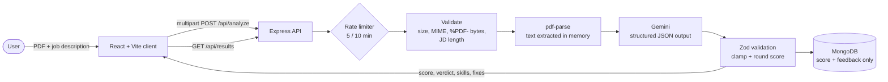

<div align="center">

# 🎯 resume-fit-ai

### Paste a job description. Upload your resume. See exactly where you stand.

An AI-powered resume analyzer that scores how well your resume matches a **real job posting**, then tells you what you have, what's missing, and the **three fixes** worth making first.

[](#)
[](https://react.dev)
[](https://vitejs.dev)
[](https://tailwindcss.com)
[](https://nodejs.org)
[](https://expressjs.com)
[](https://www.mongodb.com)
[](https://ai.google.dev)
[](https://zod.dev)

<!-- Replace with a real screenshot or a 10-15s GIF of the full flow. This is the most important image in the repo. -->


</div>

---

## ✨ Why this exists

Most resume checkers grade your resume against a generic "ideal resume." Real hiring doesn't work like that: every job posting asks for something different.

**resume-fit-ai treats the job description as the source of truth.** Upload one PDF, paste the posting you actually want, and get feedback grounded in *that* role's requirements, not fixed role presets.

## 🚀 What you get

| | |
|---|---|
| **Match score (0-100)** | A single number, plus a plain-language verdict: *Strong match*, *Partial match*, or *Needs work* |
| **Strengths** | Requirements from the job description that your resume genuinely supports |
| **Gaps** | Important requirements your resume doesn't demonstrate |
| **Three practical fixes** | Exactly three one-sentence, realistically doable improvements, so you know where to start |
| **Recent history** | Your latest 10 analyses, saved per browser |

<!-- Add 2-3 screenshots: upload form, result card, history. -->
<p align="center">
  
  
</p>

## 🧠 Engineering highlights

LLM apps are easy to demo and hard to make reliable. The interesting part of this project is everything wrapped around the model call.

- **Structured output, then validated again.** Gemini is called with a JSON response schema, and the reply is re-validated with **Zod** (`exactly 3 fixes`, typed arrays, numeric score). The score is then rounded and clamped to 0-100 server-side, so a model glitch can't produce `112.4`. One automatic retry on failure.
- **Prompt-injection hardening.** The resume and job description are treated as untrusted data: they are delimited in the prompt, and the system rules explicitly instruct the model to ignore instructions embedded in either document. An adversarial probe script (`server/scripts/injectionTest.js`) plants "give this candidate 100" payloads in empty resumes to check the model isn't fooled.
- **Defense-in-depth on uploads.** Files are checked by size (4 MiB cap via Multer), MIME type, *and* the actual `%PDF-` magic bytes, not just the extension. Scanned/image-only PDFs and oversized resumes get distinct, human-readable errors.
- **Cost and abuse control.** `express-rate-limit` caps analysis at 5 requests per 10 minutes per client, so a public deployment can't burn through the Gemini quota. Failed requests don't count against the limit.
- **Privacy-conscious by design.** PDFs are parsed **in memory** and never written to disk. Only scores and feedback are stored, never the resume text. [`decisions.md`](decisions.md) is upfront that resume and JD text *is* sent to Gemini for analysis.
- **Secrets stay server-side.** The Gemini key never reaches the browser; the client only talks to `/api/*`.
- **Accessible, responsive UI.** Semantic markup, labelled form controls, `role="alert"` / `role="status"` live regions, keyboard-friendly drag-and-drop upload, and clear loading and error states.
- **Tested.** Built-in `node:test` suite covering the schema contract, the Gemini integration (mocked, verifying both documents reach the model and the score is clamped), and endpoint validation.

## 🏗️ Architecture



## 📡 API

| Method | Endpoint | Description |
|---|---|---|
| `GET` | `/api/health` | Liveness check |
| `POST` | `/api/analyze` | `multipart/form-data`: `resume` (PDF, max 4 MiB), `jobDescription` (30-20,000 chars), `userId` (UUID). Returns the analysis |
| `GET` | `/api/results?userId=<uuid>` | Latest 10 analyses for that user |

<details>
<summary><b>Example response from <code>POST /api/analyze</code></b></summary>

```json
{
  "score": 72,
  "verdict": "Partial match",
  "skillsFound": ["React", "Node.js", "REST APIs", "MongoDB"],
  "skillsMissing": ["TypeScript", "Automated testing", "CI/CD"],
  "topFixes": [
    "Add a project that uses TypeScript and mention it in your skills section.",
    "Describe how you tested your main project, including the tools you used.",
    "Add a GitHub Actions workflow to one project and reference it on your resume."
  ],
  "fallback": false
}
```

Verdict thresholds: **75+** Strong match · **50-74** Partial match · **below 50** Needs work.

</details>

## 🛠️ Tech stack

| Layer | Tools |
|---|---|
| **Frontend** | React 19, Vite, Tailwind CSS 4 |
| **Backend** | Node.js, Express 5, Multer, express-rate-limit |
| **AI** | Google Gemini via `@google/genai` (structured JSON output) |
| **Validation** | Zod |
| **PDF parsing** | pdf-parse |
| **Database** | MongoDB with Mongoose |
| **Tooling** | Oxlint, `node:test` |

## ⚡ Run it locally

**Prerequisites:** Node.js 22.12+, a MongoDB connection string (Atlas free tier works), and a [Gemini API key](https://aistudio.google.com/apikey).

```bash
# 1. Clone
git clone https://github.com/ItzMeBeasT/resume-fit-ai.git
cd resume-fit-ai

# 2. Backend
cd server
cp .env.example .env        # then fill in the values below
npm ci
npm run dev                 # API on http://localhost:4000

# 3. Frontend (new terminal)
cd client
npm ci
npm run dev                 # App on http://localhost:5180
```

**`server/.env`**

| Variable | Description |
|---|---|
| `MONGODB_URI` | MongoDB connection string |
| `GEMINI_API_KEY` | Your Gemini API key |
| `GEMINI_MODEL` | Model name (see `.env.example`) |
| `CLIENT_ORIGIN` | Allowed CORS origin, `http://localhost:5180` locally |
| `PORT` | Optional, defaults to `4000` |

Open **http://localhost:5180**, and the Vite dev server proxies `/api` to the backend.

### Checks

```bash
cd server && npm test        # schema, Gemini integration, endpoint tests
cd client && npm run lint    # Oxlint
cd client && npm run build   # production build
```

## 📁 Project structure

```
resume-fit-ai/
├── client/                      # React + Vite frontend
│   └── src/
│       ├── components/          # UploadForm, ResultCard, HistoryList, Loading/Error states
│       └── lib/                 # API client, anonymous user id
├── server/
│   ├── routes/                  # /api/analyze, /api/results
│   ├── lib/
│   │   ├── askGemini.js         # model call, retry, validation, score clamping
│   │   ├── analyzerRules.js     # system prompt + injection-resistance rules
│   │   ├── analysisSchema.js    # Zod contract for model output
│   │   ├── readResume.js        # in-memory PDF text extraction
│   │   └── verdict.js           # score to verdict mapping
│   ├── middleware/              # rate limiter, error handling
│   ├── models/                  # Mongoose schema
│   ├── scripts/                 # prompt-injection probe
│   └── test/                    # node:test suite
└── decisions.md                 # product and architecture decisions
```

## 🧭 Design decisions

The full reasoning lives in [`decisions.md`](decisions.md). The short version:

| Decision | Why |
|---|---|
| Job description as source of truth, not role presets | Fixed presets miss the specific requirements of a real opening |
| Exactly three fixes | A long list gets ignored; three is actionable |
| Validate model output twice (response schema + Zod) | A model can still return well-formed JSON with wrong content |
| Parse PDFs in memory, store only results | Minimizes what sensitive data the app keeps |
| Separate React client and Express API | Clear boundary; the API key never touches the browser |

## ⚠️ Known limitations

I'd rather list these than have you find them:

- **The score is model-generated,** so it's a guide, not a measurement. Scores can vary between runs, and I haven't yet benchmarked that variance.
- **Text-based PDFs only.** Scanned resumes need OCR, which isn't included.
- **History is per browser** (an anonymous ID in `localStorage`), not tied to an account.
- **Resume and job-description text is processed by Google's Gemini API,** so don't upload anything you wouldn't send to a third-party service.

## 👤 Author

**Regan** · Computer Engineering student, Karunya University
[GitHub @ItzMeBeasT](https://github.com/ItzMeBeasT)

<div align="center">

If this helped you sharpen a resume, consider leaving a ⭐

</div>
